# Architecture Overview: fIRCmachine

## 1. Directory Structure and "Flat" Philosophy
All core Python modules and functional scripts are located directly within the `fircm/` directory. This flat organization is a deliberate design choice:
- **Immediate Visibility:** Developers and users can see all available entry points and utilities at a glance.
- **Import Simplicity:** Avoids complex relative import issues often encountered in nested Python packages, especially when running scripts from different working directories.
- **Developer Agility:** Facilitates rapid prototyping and modification of individual modules without worrying about package hierarchy.

## 2. File-Based Data Flow and Process Interoperability
The architecture of `fIRCmachine` is built on a **File-Based Handoff** model. Rather than passing complex, memory-heavy objects between stages, each process outputs standard file formats (`.traj`, `.xyz`, `.csv`).

### Design Advantages:
- **Workflow Flexibility:** Users can intervene at any step. For instance, one could manually refine an `.xyz` file from a DMF path before feeding it into the TS optimization stage.
- **Modular Entry/Exit:** Each component script (e.g., `pIRCmachine.py`) can serve as either a standalone tool or a step in the larger `fIRCmachine.py` workflow.
- **Resilience:** If a later stage fails, the intermediate results are already safely stored on disk, allowing for easy restarts without recomputing the entire path.

## 3. Centralized State Management (`default_config.py`)
To maintain consistency across diverse scripts, the toolkit uses a global configuration pattern:
- **The `g` Object:** `default_config.py` is imported as `g` throughout the project. This object holds system-wide parameters like `CHARGE`, `MULT`, and `CALC_TYPE`.
- **Dynamic Overrides:** While `default_config.py` provides defaults, scripts can override these values at runtime, ensuring that workflow flags are respected system-wide.

## 4. Robust I/O: "Heartless_read"
A common pain point in ASE-based workflows is the instability of the `extXYZ` format's metadata. `fIRCmachine` addresses this with `Heartless_read` (implemented as a custom `read` function in `utils.py`):
- **Metadata Neutralization:** It treats `.xyz` files as pure coordinate data, systematically ignoring the second line (comment line) to prevent ASE from attempting to parse legacy or malformed metadata.
- **Universal Compatibility:** Ensures that files edited in external text editors or generated by different software packages do not crash the pipeline.

## 5. Traceability: "angelic_log"
Operational transparency is provided by the `angelic_log` system:
- **Configuration Auditing:** Upon execution, the toolkit dumps the state of all global constants and flags to `fircm.log`.
- **Directory Tracking:** The logger is aware of `g.CURRENT_DIR`, ensuring that logs are consistently written to the active results folder even after an `os.chdir()` call.

-----

```mermaid
flowchart TD
    %% Custom Styles (Dark/Light Mode Compatible)
    %% ノード背景には両モードで背景に溶け込まない中明度の鮮やかな色を採用し、文字色を強制的に白(#ffffff)にすることで内部コントラストを独立させています。
    classDef io fill:#636e72,stroke:#b2bec3,stroke-width:2px,color:#ffffff
    classDef process fill:#0984e3,stroke:#74b9ff,stroke-width:2px,color:#ffffff
    classDef hack fill:#6c5ce7,stroke:#a29bfe,stroke-width:2px,color:#ffffff
    classDef decision fill:#e17055,stroke:#fab1a0,stroke-width:2px,color:#ffffff
    classDef file fill:#00b894,stroke:#55efc4,stroke-width:2px,color:#ffffff

    subgraph Init ["1. Initialization & Logging"]
        direction TB
        A1([Start: fIRCmachine]) --> A2{Input Type}:::decision
        A2 -->|Reactant & Product| A3["Heartless_read<br/>(Bypass extXYZ metadata)"]:::io
        A2 -->|Trajectory / XYZ| A4["Heartless_read<br/>(Multi-frame parsing)"]:::io
        A3 --> A5["angelic_log<br/>(Dump Global Config 'g')"]:::hack
        A4 --> A5
    end

    subgraph Path ["2. Initial Path Search"]
        direction TB
        A5 --> B1{INIT_PATH_SEARCH_ON?}:::decision
        B1 -->|True| B2["FB-ENM<br/>(Interpolate Geometry)"]:::process
        B2 --> B3["DirectMaxFlux (pydmf)<br/>(Path Optimization)"]:::process
        B3 --> B4[/"DMF_final.traj"/]:::file
        B1 -->|False| B4
    end

    subgraph Peak ["3. Peak Extraction"]
        direction TB
        B4 --> C1["extract_peaks_from_traj"]:::process
        C1 --> C2[/"lmax_X.xyz<br/>(Peak Images + Endpoints)"/]:::file
    end

    subgraph TS_IRC ["4. TS Optimization & IRC"]
        direction TB
        C2 --> D1{"For each internal peak<br/>(TSOPT_ON / IRC_ON)"}:::decision
        D1 --> D2["Sella TS Optimization<br/>(Auto-detect Point Group)"]:::process
        D2 --> D3["AdaptiveIRC<br/>(Dynamic dx & Rollback)"]:::hack
        D3 --> D4[/"IRC Trajectories<br/>(Forward & Reverse)"/]:::file
    end

    subgraph Thermo_Refine ["5. Thermodynamics & Refinement"]
        direction TB
        D1 --> E1{PICK_OPTPOINTS_ON?}:::decision
        E1 -->|True| E2["make_optpoints_traj<br/>(Extract IS, TS, FS)"]:::process
        E1 -->|False| E3["Use All Peaks + Endpoints"]:::process
        E2 --> E4
        E3 --> E4
        E4{"For each point<br/>(VIB_ON)"}:::decision
        E4 --> E5["Vibrational Analysis<br/>(ASE Vibrations)"]:::process
        E5 --> E6["True TS Protection &<br/>Truhlar's Floor Correction"]:::hack
        E6 --> E7{REFINE_ENERGY_ON?}:::decision
        E7 -->|True| E8["Single Point Refinement<br/>(High-level PySCF / MLIP)"]:::process
        E8 --> E9["pyscf_exporter<br/>(Export JSON & Molden)"]:::hack
        E7 -->|False| F1
        E9 --> F1
    end

    subgraph Final ["6. Finalization"]
        direction TB
        F1["write_energies<br/>(Calculate Heavy-RMSD)"]:::process
        F1 --> F2[/"result.csv"/]:::file
        F2 --> F3["instant_plot<br/>(Generate Profiles & Underglow Plot)"]:::process
        F3 --> F4([End Workflow])
    end

    %% Styles for subgraphs
    %% 透明な背景(transparent)と中間のグレーの破線にすることで、ライト/ダークどちらのモードでも視覚的に邪魔にならず枠線として機能します。
    style Init fill:transparent,stroke:#888888,stroke-width:1px,stroke-dasharray: 5 5
    style Path fill:transparent,stroke:#888888,stroke-width:1px,stroke-dasharray: 5 5
    style Peak fill:transparent,stroke:#888888,stroke-width:1px,stroke-dasharray: 5 5
    style TS_IRC fill:transparent,stroke:#888888,stroke-width:1px,stroke-dasharray: 5 5
    style Thermo_Refine fill:transparent,stroke:#888888,stroke-width:1px,stroke-dasharray: 5 5
    style Final fill:transparent,stroke:#888888,stroke-width:1px,stroke-dasharray: 5 5
```

